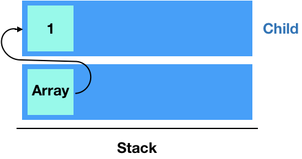

# ArrayParser

### 목표

문자열을 통해 추상화 문법 트리(AST)를 형성하는 파서를 제작한다

* 7가지 타입을 분석한다: 숫자, 문자열, null, boolean, 배열, 객체, 빈 문자열
* 에러 상황을 체크해서 어떤 문제가 있는지 에러메시지를 보여준다.


### 파싱 과정

arrayparser는 문자열을 파싱해 추상화된 문법 구조를 형성한다

파싱은 세 단계를 거친다: tokenizer -> lexer -> parser 


#### 단계별 기능

* tokenizer : 토큰화
  * 좋아한다철수는영희를  >  좋아한다, 철수는, 영희를
* lexer: 어휘 분석
  * 좋아한다, 철수는, 영희를  >  좋아한다(서술어), 철수는(주어), 영희를(목적어)
* parser: 문법 분석
  * 좋아한다(서술어), 철수는(주어), 영희를(목적어)  >  철수는 영희를 좋아한다


#### 에러 체크

처음에는 parser에서 모든 오류를 체크해서 굉장히 복잡했었다. 한 개의 예외 상황에 맞는 로직을 구현하면 다른 상황이 발생하고, 그 상황을 수정하면 다시 연쇄적으로 예외가 발생하였다. 가장 어려웠던 부분이었지만 이 문제는 모듈화로 해결되었다.

모듈화의 가장 중요한 점은 각 단계(모듈)별 할 일이 명확해야 한다는 것이었다. 모듈의 기능이 명확해질 수록 각 모듈별로 체크해야할 예외 상황도 명확해지기 때문에다. 

* tokenizer: 토큰화에만 집중하고 에러를 체크하지 않는다
  * 조아한다철수눈영희  >  조아한다, 철수눈, 영희
* lexer: 어휘만 체크한다
  * 조아한다, 철수눈, 영희  >  **조**아한다, 철수**눈**, 영희**(를)**
* parser: 문법만 체크한다
  * 좋아한다, 철수는, 영희를  >  철수는 영희를 좋아한다


#### 실제 과정

파싱할 코드:  `"[1,2,true,'mando']"`

* tokenizer

  * 결과: `[ "[", "1", "2", "true", "'mando'", "]" ]`

* lexer

  * 자료 형태

  ```javascript
  data structure = {
      key: // 배열의 원소인 경우 인덱스를, 객체의 원소인 경우 키값: parser를 거칠 때 정해진다
      type: // 토큰의 타입: 'number', 'null' 등 (해당 토큰이 키인경우 'key'를 가진다)
      value: // 토큰의 값
      state: // 토큰이 배열, 객체기호인 경우([,],{,}) 열림과 닫힘을 표시한다
      // ex) '{'의 경우 'open' 
      child: [] // 자식 노드: parser를 거칠 때 생성됨
  }
  ```

  * 결과: 

* parser

  * 결과: 

  ```Javascript
  {
      type: 'array',
      value: 'ArrayObject',
      child: [{
          key: 0,
          type: 'number',
          value: '1',
          child: []
      },{
          key: 1,
          type: 'number',
          value: '2',
          child: []
      },{
          key: 2,
          type: 'boolean',
          value: 'true',
          child: []
      },{
          key: 3,
          type: 'string',
          value: "'mando'",
          child:[]
      }]
  }
  ```

  ​

### 문법구조 형성 과정

`"[1, 2, {name: 'mando', type: 'student'}, 3]"` 문자열이 tokenizer와 lexer를 거쳐 다음과 같은 구조가 됐다.


parser에서는 **스택** 구조를 이용해 추상화된 문법 구조를 형성한다


* 초기 형태


* `[`데이터를 분석했을 때


* `1`을 분석했을 때




* `2`를 분석했을 때


* `{`을 분석했을 때


* `'student'`를 분석했을 때


* `}`을 분석했을 때


* `3`을 분석했을 때


* `]`을 분석했을 때


* 마지막에는 해당 노드를 추출한다


* 결과

```Javascript
{
    type: 'array',
    value: 'ArrayObject',
    child: [{
        key: 0,
        type: 'number',
        value: '1',
        child: []
    },{
        key: 1,
        type: 'number',
        value: '2',
        child: []
    },{
        key: 2,
        type: 'object',
        value: 'Object',
        child: [{
            key: 'name',
            type: 'string',
            value: "'mando'",
            child: []
        },{
            key: 'type',
            type: 'string',
            value: "'student'",
            child: []
        }]
    },{
        key: 3,
        type: 'number',
        value: "3",
        child:[]
    }]
}
```


# Test

구현한 arrayparser를 테스트하기 위해 테스트 모듈을 제작하였다.

모듈화가 잘 되어있으면 테스트 하기도 용이하다.


각 모듈마다 테스트 모듈이 존재한다

* tokenizer.test.js : 올바른 토큰화를 테스트
* lexer.test.js:
  * 토큰에 정보를 올바르게 더하는지 테스트
  * 상황에 맞는 적절한 에러메시지를 출력하는지 테스트
* arrayParser.test.js
  * 올바른 AST를 생성하는지 테스트
  * 상황에 맞는 적절한 에러메시지를 출력하는지 테스트


각 테스트 모듈은 test.js와 expect.js를 이용해 테스트를 진행한다.


### test.js

test모듈은 두 개의 인자를 받는다

* 테스트하는 내용을 담은 메시지 : 콘솔창에 출력한다
* 호출하는 함수(콜백함수): 호출한다


```javascript
test("true를 올바르게 파싱한다", ()=>{
    ...
    expect(result).toBe(answer);
})
```


### expect.js

expect모듈은 다음과 같이 사용된다

`expect(result).toBe(answer)`

* result: 테스트하려는 값
* answer: 답, 기대하는 값

두 값은 equal.js 모듈을 이용해 같음을 확인한다.


### equal.js

equal.js는 deepEqual을 사용해 깊이있는 비교를 한다.

* 비교하는 대상이 객체(배열 포함)가 아닐경우 : `===`연산자로 비교
* 비교하는 대상이 객체일 경우:
  * 키의 개수를 비교한다
  * 키의 값을 비교한다
  * 키의 value를 비교한다: value비교 시 equal를 이용하여 재귀적으로 비교한다.